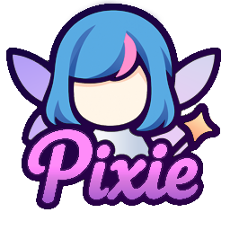

# PIXIE — Pixel Image eXporter for Instant Emotes

A beautiful Python application by **LydianMelody** that converts GIF files to VRChat-compatible sprite sheets with automatic optimization and frame management.



## ✨ Features

### 🎯 Core Functionality

- **GIF Processing**: Load and analyze GIF files with frame timing information
- **Sprite Sheet Generation**: Create VRChat-compatible 1024x1024 sprite sheets
- **Frame Management**: Intelligent frame reduction to fit VRChat limits (4, 16, or 64 frames)
- **Color Optimization**: Reduce file size with intelligent color palette optimization
- **Filename Parsing**: Extract frame count and FPS from filenames (e.g., "VRRatEmoji_14frames_20fps.png")

### 🎨 VRChat Compatibility

- **Grid Layouts**: Automatic selection of optimal grid arrangement
  - 2x2 (512x512 frames) for up to 4 frames
  - 4x4 (256x256 frames) for up to 16 frames  
  - 8x8 (128x128 frames) for up to 64 frames
- **Frame Arrangement**: Left-to-right, then top-to-bottom ordering
- **Unused Frame Handling**: Proper handling of irregular frame counts
- **VRChat Filename Format**: Automatic generation of compatible filenames

### 🖥️ User Interface

- **GUI**: It has one. I'll make it pretty later.
- **Preview**: Live preview of original GIF and generated sprite sheet
- **Interactive Controls**: Easy-to-use settings for frame count, FPS, and optimization
- **Progress Feedback**: Says when it's doing stuff. I'll add a progress bar later.
- **File Browser**: Simple file selection with suggested filenames. I intend to add drag and drop.

### 🚀 Performance & Optimization

- *I'm gonna assume the stuff below is true. Cursor wrote it I'm ngl.*
- **Fast Processing**: Optimized algorithms for quick sprite sheet generation
- **Memory Efficient**: Smart sampling and vectorized operations
- **Color Optimization**: K-means clustering with fallback methods
- **Timeout Protection**: 30-second timeout prevents hanging on large files
- **Error Recovery**: Graceful handling of optimization failures

## 🛠️ Installation

### Prerequisites

- Python 3.8 or higher
- Windows.
- MacOS, & Linux are probably also compatible but *have not been tested.*

### Quick Setup

1. **Clone or download** this repository
2. **Navigate** to the project directory
3. **Create virtual environment** (recommended):

   ```bash
   python -m venv pixie-env
   pixie-env\Scripts\activate  # Windows
   source pixie-env/bin/activate  # macOS/Linux
   ```

4. **Install dependencies**:

   ```bash
   pip install -r requirements.txt
   ```

## 🎮 Usage

### GUI Application (Recommended)

```bash
# After installing via setup (pip), run:
pixie

# Or run directly from source:
python main.py
```

**Features:**

- Load GIF files via file browser
- Real-time preview of original and sprite sheet
- Interactive frame navigation
- Adjustable settings with live feedback
- One-click sprite sheet generation and saving

### Command Line Tool

```bash
# After installing via setup (pip), run:
pixie-cli animation.gif -o output.png -f 16 -r 20

# Or run directly from source:
python quick_start.py animation.gif -o output.png -f 16 -r 20
```

**Options:**

- `-o, --output`: Output file path
- `-f, --frames`: Number of frames (1-64)
- `-r, --fps`: Frames per second
- `-s, --strategy`: Frame reduction strategy
- `--no-optimize`: Disable color optimization
- `-c, --max-colors`: Maximum colors for optimization

## 📁 Project Structure

```text
PIXIE/
├── main.py                 # Main application entry point
├── quick_start.py          # Command line interface
├── requirements.txt        # Python dependencies
├── README.md              # This file
├── ui/
│   ├── main_window.py     # GUI implementation
│   └── PixieLogo.png      # Application logo
├── src/
│   ├── gif_processor.py   # GIF loading and frame extraction
│   ├── sprite_generator.py # Sprite sheet generation
│   ├── color_optimizer.py # Color palette optimization
│   └── utils/
│       ├── filename_parser.py # VRChat filename handling
│       └── frame_reducer.py   # Frame reduction strategies
└── examples/              # Sample files and documentation
```

## 🎯 Frame Reduction Strategies

- **none**: Unchanged frames
- **uniform**: Reduces frames evenly across sequence
- **smart**: Analyzes frame differences to keep key frames
- **every_nth**: Takes every nth frame (e.g., every 2nd, 3rd frame)

## 🔧 Technical Details

### Dependencies

- **Pillow (PIL)**: Image processing and manipulation
- **imageio**: GIF loading and frame extraction
- **numpy**: Numerical operations for color optimization
- **tkinter**: GUI framework (included with Python)

### Performance Features

- **Vectorized Operations**: Fast numpy-based color processing
- **Smart Sampling**: Reduces memory usage for large images
- **Timeout Protection**: Prevents infinite processing
- **Error Recovery**: Graceful fallbacks for optimization failures

## 🎵 About PIXIE

**PIXIE** (Pixel Image eXporter for Instant Emotes) was created by **LydianMelody** to help VRChat players easily convert their GIF animations into compatible sprite sheets. The application combines powerful optimization algorithms with a beautiful, intuitive interface to make the process as smooth as possible.

## 📋 TODO

### 🎨 UI/UX Improvements

- [ ] **Responsive Design**: Make the interface adapt to different window sizes
- [ ] **Beautiful UI**: Enhance visual design with modern styling and animations
- [ ] **Dark Mode**: Add optional dark theme for better accessibility
- [ ] **Custom Themes**: Allow users to customize the interface appearance
- [ ] **Better Typography**: Improve font choices and text hierarchy
- [ ] **Smooth Animations**: Add subtle animations for better user experience
- [ ] **Accessibility**: Improve keyboard navigation and screen reader support

### 🔧 Technical Enhancements

- [ ] **Batch Processing**: Process multiple GIFs at once
- [ ] **Preset Management**: Save and load custom settings
- [ ] **Export Formats**: Support additional output formats
- [ ] **Advanced Preview**: Zoom and pan capabilities for sprite sheet preview
- [ ] **Undo/Redo**: Add history management for settings changes

## 🤝 Contributing

Contributions are welcome! Please feel free to submit issues, feature requests, or pull requests.

## 📄 License

Licensed under the Apache License, Version 2.0. See `LICENSE` for details.
Attribution is appreciated; see `NOTICE` for guidance.

## 🎵 Support

If you find PIXIE helpful, cool! Have a lovely day!

---

<!-- markdownlint-disable-next-line MD036 -->
*Made with ❤️ and 🎵 by LydianMelody*
